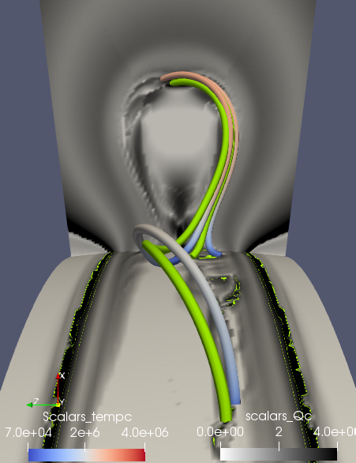
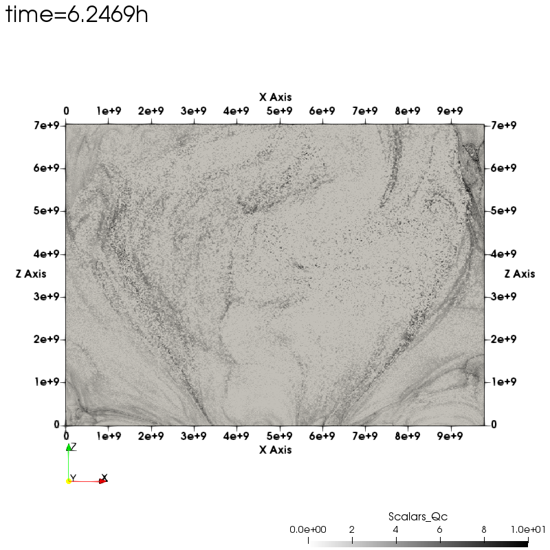
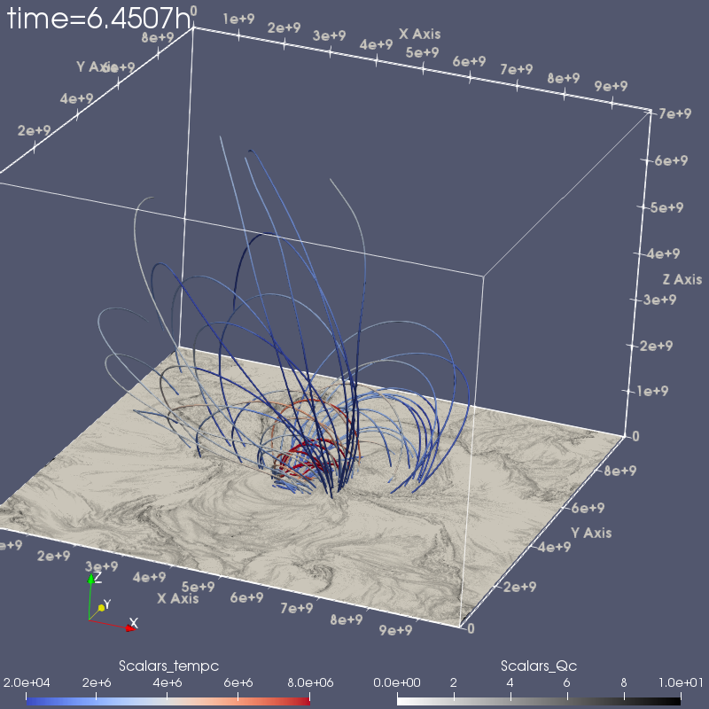

<h1>Table of Contents<span class="tocSkip"></span></h1>
<div class="toc"><ul class="toc-item"><li><span><a href="#Work-flow-chart" data-toc-modified-id="Work-flow-chart-1"><span class="toc-item-num">1&nbsp;&nbsp;</span>Work flow chart</a></span></li><li><span><a href="#Simulations-in-sphe.-coordinates" data-toc-modified-id="Simulations-in-sphe.-coordinates-2"><span class="toc-item-num">2&nbsp;&nbsp;</span>Simulations in sphe. coordinates</a></span><ul class="toc-item"><li><span><a href="#sphe.-data-for-range(-161,220,1)" data-toc-modified-id="sphe.-data-for-range(-161,220,1)-2.1"><span class="toc-item-num">2.1&nbsp;&nbsp;</span>sphe. data for range( 161,220,1)</a></span></li><li><span><a href="#flux-rope-evolution:for-range(0,160,10)-&amp;-range(165,210,1)" data-toc-modified-id="flux-rope-evolution:for-range(0,160,10)-&amp;-range(165,210,1)-2.2"><span class="toc-item-num">2.2&nbsp;&nbsp;</span>flux rope evolution:for range(0,160,10) &amp; range(165,210,1)</a></span></li><li><span><a href="#model0160-structure" data-toc-modified-id="model0160-structure-2.3"><span class="toc-item-num">2.3&nbsp;&nbsp;</span>model0160 structure</a></span></li><li><span><a href="#Velocity-at-dips-and-apex" data-toc-modified-id="Velocity-at-dips-and-apex-2.4"><span class="toc-item-num">2.4&nbsp;&nbsp;</span>Velocity at dips and apex</a></span></li><li><span><a href="#MFR-structure:QSL-in-3D" data-toc-modified-id="MFR-structure:QSL-in-3D-2.5"><span class="toc-item-num">2.5&nbsp;&nbsp;</span>MFR structure:QSL in 3D</a></span><ul class="toc-item"><li><span><a href="#Reconnection-at-apexes-(#mrap)" data-toc-modified-id="Reconnection-at-apexes-(#mrap)-2.5.1"><span class="toc-item-num">2.5.1&nbsp;&nbsp;</span>Reconnection at apexes (#mrap)</a></span></li><li><span><a href="#Reconnection-processes" data-toc-modified-id="Reconnection-processes-2.5.2"><span class="toc-item-num">2.5.2&nbsp;&nbsp;</span>Reconnection processes</a></span></li><li><span><a href="#Reconnection-at-dips" data-toc-modified-id="Reconnection-at-dips-2.5.3"><span class="toc-item-num">2.5.3&nbsp;&nbsp;</span>Reconnection at dips</a></span></li><li><span><a href="#Reconnection-processes" data-toc-modified-id="Reconnection-processes-2.5.4"><span class="toc-item-num">2.5.4&nbsp;&nbsp;</span>Reconnection processes</a></span></li><li><span><a href="#Snapshots-of-the-MFR" data-toc-modified-id="Snapshots-of-the-MFR-2.5.5"><span class="toc-item-num">2.5.5&nbsp;&nbsp;</span>Snapshots of the MFR</a></span></li></ul></li><li><span><a href="#Velocity-field" data-toc-modified-id="Velocity-field-2.6"><span class="toc-item-num">2.6&nbsp;&nbsp;</span>Velocity field</a></span></li><li><span><a href="#Todo-list" data-toc-modified-id="Todo-list-2.7"><span class="toc-item-num">2.7&nbsp;&nbsp;</span>Todo list</a></span></li><li><span><a href="#qustions:" data-toc-modified-id="qustions:-2.8"><span class="toc-item-num">2.8&nbsp;&nbsp;</span>qustions:</a></span></li></ul></li><li><span><a href="#Simulations-in-cart.-coordinates" data-toc-modified-id="Simulations-in-cart.-coordinates-3"><span class="toc-item-num">3&nbsp;&nbsp;</span>Simulations in cart. coordinates</a></span><ul class="toc-item"><li><span><a href="#cart.-data-for-range(-0900,1192,1)xys-&amp;-range(1124--1184)+(942,1003,1)xzs-&amp;yzs" data-toc-modified-id="cart.-data-for-range(-0900,1192,1)xys-&amp;-range(1124--1184)+(942,1003,1)xzs-&amp;yzs-3.1"><span class="toc-item-num">3.1&nbsp;&nbsp;</span>cart. data for range( 0900,1192,1)xys &amp; range(1124--1184)+(942,1003,1)xzs &amp;yzs</a></span></li><li><span><a href="#cart.-data-for-range(-0981,1018,1):80;range(-0950,1018,1):40" data-toc-modified-id="cart.-data-for-range(-0981,1018,1):80;range(-0950,1018,1):40-3.2"><span class="toc-item-num">3.2&nbsp;&nbsp;</span>cart. data for range( 0981,1018,1):80;range( 0950,1018,1):40</a></span></li><li><span><a href="#Todo-list" data-toc-modified-id="Todo-list-3.3"><span class="toc-item-num">3.3&nbsp;&nbsp;</span>Todo list</a></span></li><li><span><a href="#Questions:" data-toc-modified-id="Questions:-3.4"><span class="toc-item-num">3.4&nbsp;&nbsp;</span>Questions:</a></span></li></ul></li><li><span><a href="#talk-with-fan-and-zhao:" data-toc-modified-id="talk-with-fan-and-zhao:-4"><span class="toc-item-num">4&nbsp;&nbsp;</span>talk with fan and zhao:</a></span><ul class="toc-item"><li><span><a href="#The-models-to-Fan" data-toc-modified-id="The-models-to-Fan-4.1"><span class="toc-item-num">4.1&nbsp;&nbsp;</span>The models to Fan</a></span></li><li><span><a href="#Zhao's-work:" data-toc-modified-id="Zhao's-work:-4.2"><span class="toc-item-num">4.2&nbsp;&nbsp;</span>Zhao's work:</a></span></li><li><span><a href="#Liu's-work:" data-toc-modified-id="Liu's-work:-4.3"><span class="toc-item-num">4.3&nbsp;&nbsp;</span>Liu's work:</a></span></li></ul></li><li><span><a href="#CMS-boundary-condition-and-grid-structure" data-toc-modified-id="CMS-boundary-condition-and-grid-structure-5"><span class="toc-item-num">5&nbsp;&nbsp;</span>CMS boundary condition and grid structure</a></span><ul class="toc-item"><li><span><a href="#A-reference" data-toc-modified-id="A-reference-5.1"><span class="toc-item-num">5.1&nbsp;&nbsp;</span>A reference</a></span></li></ul></li><li><span><a href="#FanMHDmodel" data-toc-modified-id="FanMHDmodel-6"><span class="toc-item-num">6&nbsp;&nbsp;</span>FanMHDmodel</a></span></li><li><span><a href="#fandatastructure" data-toc-modified-id="fandatastructure-7"><span class="toc-item-num">7&nbsp;&nbsp;</span>fandatastructure</a></span><ul class="toc-item"><li><span><a href="#sphe." data-toc-modified-id="sphe.-7.1"><span class="toc-item-num">7.1&nbsp;&nbsp;</span>sphe.</a></span></li></ul></li><li><span><a href="#Force-free-degree" data-toc-modified-id="Force-free-degree-8"><span class="toc-item-num">8&nbsp;&nbsp;</span>Force free degree</a></span><ul class="toc-item"><li><span><a href="#To-do-list:" data-toc-modified-id="To-do-list:-8.1"><span class="toc-item-num">8.1&nbsp;&nbsp;</span>To do list:</a></span></li><li><span><a href="#Questions" data-toc-modified-id="Questions-8.2"><span class="toc-item-num">8.2&nbsp;&nbsp;</span>Questions</a></span></li></ul></li></ul></div>

## Work flow chart
- Get what we need form raw data, the initial work flow, maybe not good for now. 


## Simulations in sphe. coordinates

### sphe. data for range( 161,220,1)
- directory:/glade/u/home/liutie/polysph_3dfulltherm_15.3_run19.heating2_sts_1sb/1mulf3/
*********************
*********************
1. The distribution of current, Q, density and temperature.
- Magnetic flux rope （MFR） structure: filaments, cavity, hot core, horns. What are their relationship.
- The apexes and dips are consistent with high Q regions where magnetic reconnections (MRs) occur preferentially. The apexes regions show reconnection and temperature rising first and the dips regions reconnect later, which is represented by temperature increasing. MRs may play a role to increase the twist of the MFR and decrease the restriction of the ambient arcade field at the apex regions. MRs at dips regions may be represent the occurring of the instability or the eruption.
- Filaments in dips can be divide into two parts: the lower part and the higher part. The lower part possesses high density and low current, the higher part has high density and high current. We guess only the higher part will erupt during the eruption while the lower part will keep still. There is a boundary between two high Q regions which may serves as the division between the two parts of the filaments and evolves into the classical X-structure or HFT where MRs take place, which is represented by temperature rising.

<div style="float:left; width:1000px;">
<span style="float:left; width:500px;"></span>
<span style="float:left; width:500px;"></span>
</div>

<div style="float:left; width:1000px;">
<span style="float:left; width:500px;"></span>
<span style="float:left; width:500px;"></span>
</div>

### flux rope evolution:for range(0,160,10) & range(165,210,1)
- directory:/glade/u/home/liutie/polysph_3dfulltherm_15.3_run19.heating2_sts_1sb/
*********************
*********************
1. Magnetic flux rope evolution: field lines are colored by temperature, bottom shows the Q distribution. Drawing with start points from Fan.
- Magnetic flux rope evolution: field lines are colored by temperature, bottom and vertical slits shows the Q distribution. Drawing with start points averagely distribution at bottom. 

<div style="float:left; width:1000px;">
<span style="float:left; width:500px;"></span>
<span style="float:left; width:500px;"></span>
</div>

<div style="float:left; width:1000px;">
<span style="float:left; width:500px;"></span>
<span style="float:left; width:500px;"></span>
</div>

### model0160 structure
- directory:/glade/u/home/liutie/polysph_3dfulltherm_15.3_run19.heating2_sts_1sb/
*********************
*********************
1. Field lines are colored by temperature and density and go through filaments, hot core and hot cavity.
- Bottom show Br and vertical slices show temperature, Q and current distribution.
- We find field lines going through hot core are with higher temperature, density, current and lower Q than their ambient regions (cavity) while they do not have dips. 
- Field lines going through filaments and hot cavity have dips and apexes, dips have high density and low temperature while apexes have high temperature and low density.

<div style="float:left; width:1000px;">
<span style="float:left; width:500px;"></span>
<span style="float:left; width:500px;"></span>
</div>

<div style="float:left; width:1000px;">
<span style="float:left; width:500px;"></span>
<span style="float:left; width:500px;"></span>
</div>

<div style="float:left; width:1000px;">
<span style="float:left; width:500px;"></span>
<span style="float:left; width:500px;"></span>
</div>

### Velocity at dips and apex
- directory:/glade/u/home/liutie/polysph_3dfulltherm_15.3_run19.heating2_sts_1sb/1paraview/
*********************
*********************


<div style="float:left; width:1000px;">
<span style="float:left; width:500px;"></span>
<span style="float:left; width:500px;"></span>
</div>

### MFR structure:QSL in 3D 
- directory:/glade/u/home/liutie/polysph_3dfulltherm_15.3_run19.heating2_sts_1sb/1paraview/
*********************
*********************
1. We show Q distribution at bottom and vertical slits and 3D isosurface of high Q regions, there are 4 pairs  high Q regions which are green counters where logQ = 3 and are the footpoints of the reconnected field lines. Which is discussed in detail at [2.4.1&2.4.2](#mrap). Current isosurface colored by temperature is also displayed. 
- Two high Q regions are showed in the vertical slit(panel 2), the dips regions and the apexes regions which are consistent with 4 pairs high Q regions at bottom. We show 3D high Q isosurface like panels 3 and 4. The inverse-S shape high Q isosurface goes through dips regions and divides into two parts as panels 2 and 4 shown. The higher part is consistent with current isosurface (panels 5 and 6). We guess the higher part with high Q as well as high current is easy to erupt cause Lorentz force acts on the strong current region. 
 

<div style="float:left; width:1000px;">
<span style="float:left; width:500px;"></span>
<span style="float:left; width:500px;"></span>
</div>
<div style="float:left; width:1000px;">
<span style="float:left; width:500px;"></span>
<span style="float:left; width:500px;"></span>
</div>


<div style="float:left; width:1000px;">
<span style="float:left; width:670px;"></span>
<span style="float:left; width:330px;"></span>
</div>

<div style="float:left; width:1000px;">
<span style="float:left; width:500px;"></span>
<span style="float:left; width:500px;"></span>
</div>

<div style="float:left; width:1000px;">
<span style="float:left; width:500px;"></span>
<span style="float:right; width:500px;"></span>
<span style="float:left; width:500px;"></span>
</div>

<div style="float:left; width:1000px;">
<span style="float:left; width:500px;"></span>
<span style="float:left; width:500px;"></span>
</div>

#### Reconnection at apexes (#mrap)
1. Four field lines (two green and two colored by temperature) going through the apexes high Q regions show how the magnetic reconnection (MR) occurs. Two green field lines reconnect and become two inverse-s shape field lines colored by temperature. Which increases the twist of the MFR and decreases the restriction of the ambient arcade field at the apex regions.

<div style="float:left; width:1000px;">
<span style="float:left; width:500px;"></span>
<span style="float:right; width:500px;"></span>
<span style="float:left; width:500px;"></span>
</div>

#### Reconnection processes
1. High-lying sheared arcade reconnects with helical field line in the top of the flux rope and become two inverse s-shape field lines during the magnetic flux emergence. And field lines move with reconnection outflows as the vertical slit showing.
- The footpoints of the reconnected field lines jump between high Q regions.
- Field lines lose dips during they erupting.
- The reconnection opens the door for the eruption, which may lead to the fast rise.


<div style="float:left; width:1000px;">
<span style="float:left; width:500px;"></span>
<span style="float:left; width:500px;"></span>
</div>

<div style="float:left; width:1000px;">
<span style="float:left; width:500px;"></span>
<span style="float:left; width:500px;"></span>
</div>

<div style="float:left; width:1000px;">
<span style="float:left; width:500px;"></span>
<span style="float:left; width:500px;"></span>
</div>

<div style="float:left; width:1000px;">
<span style="float:left; width:500px;"></span>
<span style="float:left; width:500px;"></span>
</div>


<div style="float:left; width:1000px;">
<span style="float:left; width:500px;"></span>
<span style="float:left; width:500px;"></span>
</div>

<div style="float:left; width:1000px;">
<span style="float:left; width:500px;"></span>
<span style="float:left; width:500px;"></span>
</div>

#### Reconnection at dips
1. Three field lines (two green and one colored by temperature) go through the dips high Q regions show how the magnetic reconnection (MR) occurs. Two J-shape green field lines reconnect and become a inverse-s shape field line colored by temperature.

<div style="float:left; width:1000px;">
<span style="float:left; width:500px;"></span>
<span style="float:right; width:500px;"></span>
<span style="float:left; width:500px;"></span>
</div>

#### Reconnection processes
1. Two J-shape field lines reconnect to a sigmoidal field line with deep dip and then it evolves to with relatively shallow dip and with no dip and erupts.
- The outer side footpoints of the two J-shape field lines are fixed while their center side footpoints approach each other resulting in reconnections.
- The sigmoidal field line loses dip due to reconnections or magnetic tension force.
- The Two J-shape field lines become sigmoidal field lines, which contribute to the increasing of the axial flux of the magnetic flux core.
- 

<div style="float:left; width:1000px;">
<span style="float:left; width:500px;"></span>
<span style="float:left; width:500px;"></span>
</div>

<div style="float:left; width:1000px;">
<span style="float:left; width:500px;"></span>
<span style="float:left; width:500px;"></span>
</div>

<div style="float:left; width:1000px;">
<span style="float:left; width:500px;"></span>
<span style="float:left; width:500px;"></span>
</div>

<div style="float:left; width:1000px;">
<span style="float:left; width:500px;"></span>
<span style="float:left; width:500px;"></span>
</div>


#### Snapshots of the MFR
1. Red and green field lines go through high Q regions are consistent with 3D high Q isosurface, other field lines colored by temperature are chosen form the vertical slit. Two thicker magnetic lines are represented the flux rope axis. Panels 5 and 6 show the Interfaces between the field lines and bottom as well as vertical slits.

<div style="float:left; width:1000px;">
<span style="float:left; width:500px;"></span>
<span style="float:left; width:500px;"></span>
</div>

<div style="float:left; width:1000px;">
<span style="float:left; width:500px;"></span>
<span style="float:left; width:500px;"></span>
</div>

<div style="float:left; width:1000px;">
<span style="float:left; width:500px;"></span>
<span style="float:left; width:500px;"></span>
</div>

### Velocity field
1. Dips reconnection:inflow and outflow
- Apex reconnection:inflow and outflow


### Todo list
1. Compute 3D Q and current distribution.
- Show field lines with 3D Q and density.
- Reconnection processes.
- Flux rope and filaments build up


### qustions:
1. what are the relationships between filament, cavity, hot core and horns and how they evolve
- Their physical features.


```python
a=75.5556/0.5
t1=6.2
b=950+(t1-6.2469)*a
print(b)
```

## Simulations in cart. coordinates

### cart. data for range( 0900,1192,1)xys & range(1124--1184)+(942,1003,1)xzs &yzs
- directory:/glade/work/liutie/cart_data/
- Eruption1:5.8--6.8 hr  Q:6.2--6.6(942.91--1003.36)
- Eruption2:7.4--7.8 hr  Q:7.4--7.8(1124.25--1184.69)
- 0.5hr==75.5it
- 0950==6.2469hr
*********************
*********************
1. Q distribution of xy(bottom)  xz(middle) and yz(middle) slices
- S-shape sigmoid without eruption maybe a jet.
- delta0=9.53674e-05 VS delta0=0.5

<div style="float:left; width:1000px;">
<span style="float:left; width:500px;"></span>
<span style="float:left; width:500px;"></span>
</div>

<div style="float:left; width:1000px;">
<span style="float:left; width:500px;"></span>
<span style="float:left; width:500px;"></span>
</div>

<div style="float:left; width:1000px;">
<span style="float:left; width:500px;"></span>
<span style="float:left; width:500px;"></span>
</div>

### cart. data for range( 0981,1018,1):80;range( 0950,1018,1):40
- directory:/glade/u/home/liutie/cart_data/av80
- directory:/glade/u/home/liutie/cart_data/av40
*********************
*********************
1. Show field lines colored by temperature with footpoints in 80*80 square. 
- Show field lines colored by temperature with footpoints in 40*40 square. 

<div style="float:left; width:1000px;">
<span style="float:left; width:500px;"></span>
<span style="float:left; width:500px;"></span>
</div>

<div style="float:left; width:1000px;">
<span style="float:left; width:500px;"></span>
<span style="float:left; width:500px;"></span>
</div>

<div style="float:left; width:1000px;">
<span style="float:left; width:500px;"></span>
<span style="float:left; width:500px;"></span>
</div>

### Todo list
1. Compute Q of all the slits
-  Find eruptions (how many homologous flares)
  - Synthetic images
  - Q maps
- test drawing field lines to show flux rope
- Find characteristic time and show all the physical parameters (structure)

### Questions:
1. How to track the field lines so that they can always respect the MFR : fix footpoint or according to bottom 
B
- How to confirm MFR and HFT in QSL  : which slice 

## talk with fan and zhao:

20140910event:


### The models to Fan
1. directory: /glade/work/liutie/cms2/20120712bs
1. directory: /glade/work/liutie/cms2/20140910bs
*********************
*********************


### Zhao's work:


### Liu's work:


## CMS boundary condition and grid structure
In CMS Version 2.0, the object of interest (e.g., an active region or filament) is modeled with
high spatial resolution (the HIRES region), and the more distant regions are modeled with a lower
resolution, global potential field (GLOBAL region).The HIRES region is a NLFF field and the GLOBAL region is a potential field. The model we export is NLFF field in the HIRES region which is the domain used as initial condition of the MHD simulation. 
- Both regions use the spherical coordinate system ($r$,$\theta$ ,$\phi$ )
  - where r is the radial distance from Sun center, 
  - $\theta$ is the polar angle relative to the solar rotation axis, We frequently use the latitude $\lambda$ ($\pi/2-\theta$) instead of the polar angle,
  - and $\phi$ is the azimuth angle which is measured relative to the central meridian as seen from Earth at the model time.
  - $\theta_{min}<\theta<\theta_{max}$ & $\lambda_{min}<\lambda<\lambda_{max}$ & $r_{\odot}<r<r_{max}$
    - $r=r_{\odot}$ where the magnetic field is observed photosphere field and $r=r_{max}$ where the magnetic field becomes radial,
    - At the side boundaries of the domain, the magnetic field lines pass from the HIRES region into the GLOBAL region. The normal component of the magnetic field needs to be continuous at these side boundaries, but there may be small discontinuities in the tangential components.
    
- In the HIRES region, the vector potential A(r), magnetic field B(r), and current density j(r)
are discretized on staggered grids.
  - $A_{\phi}$ and $j_{\phi}$ are defined at the centers of the x-edges of the cells (halfway between two corner points),$A_{\theta}$ and $j_{\theta}$ are defined on the y-edges and $A_{r}$ and $j_{r}$ are defined on the z-edges.
  - The magnetic field $B_{\phi}$ is defined at the centers of the x-face (between four corner points), and similar for B$B_{\theta}$ and $B_{r}$.

### A reference 
1. Yang Guo2019 http://adsabs.harvard.edu/abs/2019ApJ...870L..21G
   - Solar Magnetic Flux Rope Eruption Simulated by a Data-Driven Magnetohydrodynamic Model
     - MHD model:zero-$\beta$ approximation
     - Initial conditions:(Page 4)
       - B:NLFF field from extrapolation
       - $\rho$:solving the hydrostatic equation
       - The initial condition for the velocity is zero for all the three components
     - Boundary conditions:(Page 5)
       - Data-driven boundary condition
       - Data-constrained boundary condition
       
   - My Inspiration (picture 5)
      1. The 20 minutes shift between observation and simulation may be due to the 1-D distribution $\rho$.  It will take less time to lead to the eruption if ignore the 3-D distribution $\rho$, because $\rho$ in flux rope (filaments) is higher than ambient environment, which should prevent the eruption.
      2. The difference eruption velocity between observation and simulation may be also due to the 1-D distribution $\rho$ or the limitations of the zero-$\beta$ simulation.
      3. To obtain the 3-D distribution $\rho$ which is consistent with the NLFF field B, deep learning may be helpful.
      4. GAN neural network can serve as a method that translate B to $\rho$, P, v. We use the previous simulation results as the train data to build the mapping between B and other physical characteristics($\rho$, P, v). And then produce related $\rho$, P, v of a new B through the trained GAN neural network, set them as the initial conditions of a MHD simulaiton.
      
    
 

## FanMHDmodel

<font size=4>Summary of simulations</font>

Case label |initial streamer |R' $({R_\odot})^{a}$ |B $B_t a/R' (G)^b$ |${\phi_{max}}^c$ |emerged twist $(winds)^d$ |filaments |$v_{solar wind}$ |C |The radiative loss function |coronal heating
-|-|-|-|-|-|-|-|-|-|-
WS-L| wide streamer| 0.75| 100| $75^\circ$| 1.83 |yes |higher |1 |actual |-
WS-M| wide streamer| 0.5| 103| $37.5^\circ$| 1.1 |- |- |1 |actual |-
NS-S| narrow streamer| 0.25| 90| $37.5^\circ$| 0.6 |no |lower |1 |actual |-
PROM|wide streamer| 0.75|103 |$75^\circ$ |-|yes(more)|- |1.5 |actual |-
Non_PROM|wide streamer| 0.75|103 |$75^\circ$ |-|yes(more)|- |1 |non-prom |-
fan2019 |narrow streamer *2 |0.75 |106 |$75^\circ$ |1.76 |yes |- |- |actual |two exponentially decaying(eq1)

- a curvature radius of the torus
- b axial field strength of the torus
- c domain size in $\Phi: [-\Phi_{max}; \Phi_{max}]$
- d total field line twist about the axial field line in the corona between the anchored ends when the
emergence is stopped


With the use of a higher value of C in equation (18) of F17 in the current PROM simulation, which increases the coronal base pressure given the same downward heat conduction flux, we find the formation of a more massive and extended prominence with more dips forming prominence condensations during the quasi-static phase compared to the WS-L case in F17.

In this paper we carry out MHD simulations of the evolution of coronal flux ropes under coronal streamers,
and explicitly include the non-adiabatic effects that allow for the formation of prominence condensations, and model the destabilization and eruption of the flux ropes with the more realistic treatment of the thermodynamics.

Model:semi-relativistic MHD equations in spherical geometry (p3 fan2017)
1. fully ionized hydrogen gas with the adiabatic index $\gamma= 5/3$,
1. explicitly include a simple empirical coronal heating,
- optically thin radiative losses,
- the field aligned thermal conduction

the "Magnetic Flux Eruption"(MFE) code:
1. a staggered $r-\theta-\phi$ grid with a second order accurate spatial discretization.
- The code uses an explicit 3rd order Runge-Kutta scheme for temporal discretization.

Our simulations are carried out in a spherical wedge domain:
1. $r_{\odot}<r<11.47r_{\odot}$ & $75^\circ<\theta<105\circ$ & $\theta_{min}<\theta<\theta_{max}$
- $\theta_{max}=75^\circ$:grid of $504(r)*196(\theta) * 960(\phi) $
- $\theta_{max}=37.5^\circ$ :grid of $504(r)*196(\theta) * 480(\phi) $
- The grid is uniform in $\theta and \phi$ and stretched in the r direction.
- At certain time periods during the simulations, we impose the emergence of a twisted magnetic torus at
the lower boundary by specifying the electric field.
- For the side boundaries of the simulation domain, we assume non-penetrating stress-free boundary for the velocity field and perfectly electric conducting walls for the magnetic field. For the top boundary, we use a simple outward extrapolating boundary condition that allows plasma and magnetic field to flow through.

For the initial state of the simulations,we initialize two dierent 2D quasi-steady solutions of a coronal streamer with a background solar wind:
1. a wide streamer (WS) solution and a narrow streamer (NS) solution
- we first construct an initial potential magnetic field together with a hydrostatic atmosphere with a specified temperature profile.
  - The initial potential field is a 2D arcade field (invariant in $\Phi$)
  - the potential field is stretched out into a streamer configuration


## fandatastructure
### sphe.
- in,jn,kn
- b1_(0:in-2,0:jn-2,0:kn-2)
- b1c(2:in-4,2:jn-4,2:kn-4)--b1c(504,192,960)

## Force free degree
- 20140919
<div style="float:left; width:1000px;">
<span style="float:left; width:500px;"></span>
<span style="float:left; width:500px;"></span>
</div>


- 20120712
<div style="float:left; width:1000px;">
<span style="float:left; width:500px;"></span>
<span style="float:left; width:500px;"></span>
</div>
<div style="float:left; width:1000px;">
<span style="float:left; width:500px;"></span>
<span style="float:left; width:500px;"></span>
</div>

### To do list:
1. start with the model of 20140910event to run MHD simulation
- compare with each other and confirm more

### Questions
1.


- haha    `haha` *haha* **haha**


[1] haha

    [1] haha 


```python

```
